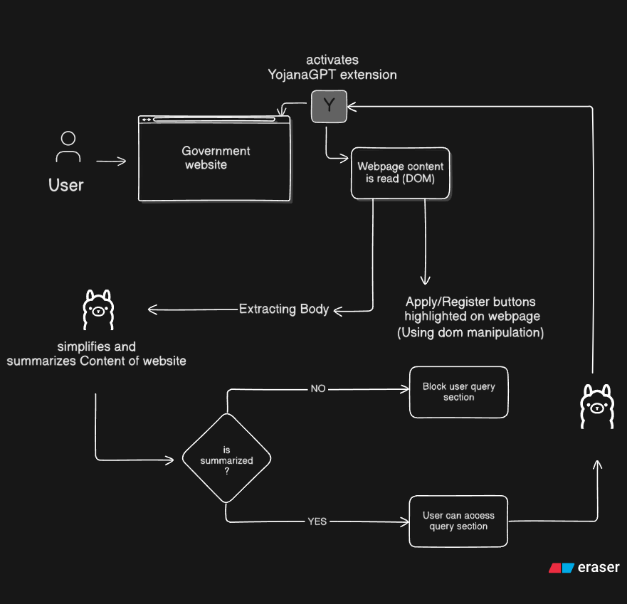
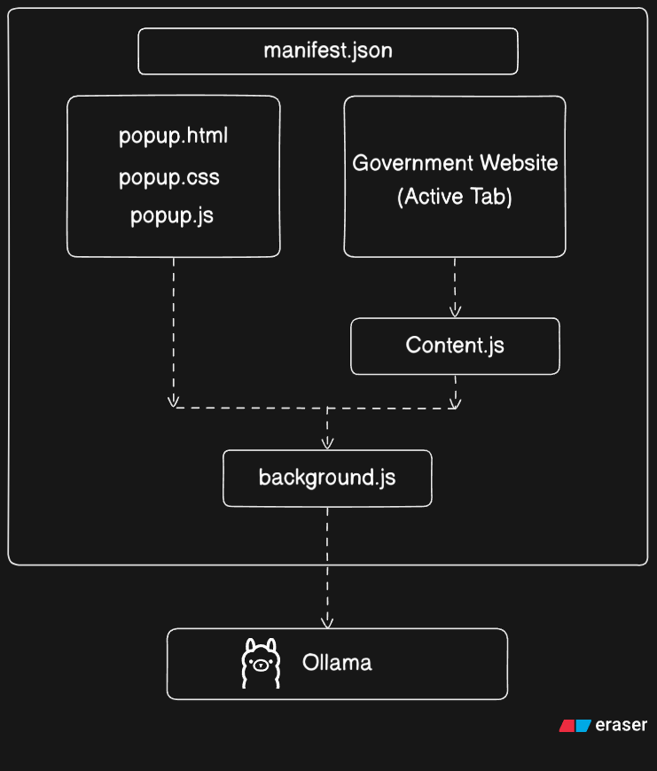

# YojanaGPT — AI Government Scheme Assistant

**YojanaGPT** is an AI-powered Chrome extension that makes Indian government scheme websites easier to understand and navigate.

Instead of reading long and complex government webpages, users can open the YojanaGPT extension to automatically extract the relevant page content, generate a concise AI summary, translate the summary into **Hindi or Marathi**, highlight important action links such as **Apply, Registration, eKYC, Status, Helpdesk, Grievance**, and ask follow-up questions about the scheme.

The project uses **Ollama and locally running LLMs**, so AI processing can happen locally without requiring a cloud AI API key.

---

## ✨ Features

### 🤖 AI-Powered Scheme Summarization

YojanaGPT extracts the meaningful content from the current webpage and generates a short, structured summary.

The summary focuses on:

- 📌 What the scheme is
- 💡 Key benefits
- 👥 Who can benefit
- 📝 How to apply
- ⚠️ Important information
- 💰 Financial benefits and amounts
- 📅 Important dates and requirements

The summarization prompt explicitly instructs the model to use only the extracted webpage content and avoid inventing information.

---

### 🌐 Multilingual Support

Users can switch the generated summary between:

- 🇬🇧 English
- 🇮🇳 Hindi
- 🇮🇳 Marathi

Translations preserve the original structure, bullet points, emojis, and highlighted important terms.

---

### 🔎 Smart Page Content Extraction

The extension doesn't blindly send the entire webpage to the AI model.

It attempts to identify the main content using elements such as:

```text
main
article
[role="main"]
#content
#main
.content
.main-content
.container
```

It also filters common webpage noise such as:

- Navigation menus
- Headers
- Footers
- Sidebars
- Scripts
- Styles
- Social/share sections

This helps provide the LLM with more relevant information.

---

### 🔗 Smart Action-Link Highlighting

YojanaGPT automatically detects important links related to government-scheme actions.

Examples include:

```text
Apply
Register
Login
Status
eKYC
KYC
Beneficiary
Helpdesk
Grievance
Download
Correction
Search
```

Detected links are visually highlighted on the webpage so users can quickly find the action they need.

---

### 💬 Context-Aware AI Chat

After generating the summary, users can ask questions about the current scheme.

For example:

```text
Who is eligible for this scheme?

How much financial assistance is provided?

What documents are required?

How can I apply?

Is eKYC mandatory?

What is the deadline?
```

The assistant uses the webpage content and previous conversation history to generate contextual answers.

If the information isn't available on the page, the model is instructed to clearly say:

> "This is not mentioned on the page you shared."

---

### 🧠 Local AI with Ollama

YojanaGPT uses **Ollama** as the local AI runtime.

Default endpoint:

```text
http://127.0.0.1:11434
```

The extension can automatically detect an installed model and prefers models according to a predefined priority order, including:

```text
llama3.3
llama3.2
llama3.1
qwen2.5
mistral
gemma2
phi3
phi4
deepseek-r1
```

This allows the project to work with different locally installed LLMs.

---

## 🏗️ Architecture

### 1. System Architecture





---

## 🛠️ Tech Stack

| Technology | Purpose |
|---|---|
| **JavaScript** | Extension logic |
| **HTML** | Popup interface |
| **CSS** | Popup UI and webpage highlighting |
| **Chrome Extensions API** | Browser integration |
| **Manifest V3** | Extension architecture |
| **Ollama** | Local LLM runtime |
| **Llama / Qwen / Mistral / etc.** | AI models |

---

## 📁 Project Structure

```text
YojanaGPT/
│
├── manifest.json
├── popup.html
├── popup.css
├── popup.js
├── content.js
└── background.js
```

### `manifest.json`

Defines the Chrome extension configuration, permissions, popup, content scripts, and Ollama host access.

### `popup.html`

Contains the extension interface including:

- Page information
- Scheme summary
- Translation controls
- Chat interface
- User input

### `popup.css`

Controls the visual design of the extension popup, including the header, summary cards, chat messages, translation buttons, and input interface.

### `popup.js`

Handles the popup functionality:

- Reading the active tab
- Receiving page information
- Displaying summaries
- Translating summaries
- Managing chat history
- Sending user questions

### `content.js`

Runs on webpages and handles:

- Main-content extraction
- Noise removal
- Page metadata collection
- Action-link detection
- Important-link highlighting

### `background.js`

Acts as the bridge between the Chrome extension and Ollama.

It handles:

- Ollama model discovery
- Model selection
- Prompt generation
- Scheme summarization
- Chat requests
- Hindi translation
- Marathi translation
- Request timeouts and errors

---

## ⚙️ How It Works

### 1. Open a Government Scheme Website

Visit an Indian government scheme webpage in Chrome.

### 2. Open YojanaGPT

Click the YojanaGPT extension icon.

The extension retrieves the active webpage's:

```text
Title
URL
Main page content
Links
```

### 3. Extract Relevant Content

YojanaGPT identifies the most relevant content while filtering navigation, footer, scripts, and other unnecessary elements.

### 4. Generate AI Summary

The extracted content is sent to the locally running Ollama model.

The model generates a concise scheme summary.

### 5. Find Important Actions

The content script detects important links such as:

```text
Apply
Register
eKYC
Status
Helpdesk
Grievance
```

and highlights them directly on the webpage.

### 6. Translate

The generated English summary can be translated into:

```text
हिंदी
मराठी
```

### 7. Ask Questions

Once the summary is available, users can ask follow-up questions about the scheme.

---

## 🚀 Installation

### Prerequisites

Install:

- Google Chrome
- Ollama
- At least one compatible local LLM

Install Ollama from:

```text
https://ollama.com
```

Then download a model, for example:

```bash
ollama pull llama3.2
```

Verify Ollama is running:

```bash
ollama list
```

---

## 🧩 Load the Extension in Chrome

1. Clone or download this repository.

2. Open:

```text
chrome://extensions
```

3. Enable:

```text
Developer mode
```

4. Click:

```text
Load unpacked
```

5. Select the project directory.

6. Open a government scheme webpage.

7. Click the **YojanaGPT** extension icon.

---

## ⚠️ Ollama Browser-Origin Configuration

Because the Chrome extension communicates directly with the local Ollama server, Ollama may need to allow requests from the browser extension.

If you encounter:

```text
Ollama HTTP 403
```

configure the Ollama origins appropriately and restart Ollama.

The project currently uses:

```text
http://127.0.0.1:11434
```

as its local Ollama endpoint.

---

## 🔐 Privacy

YojanaGPT is designed around **local AI processing**.

The project communicates with a locally running Ollama server rather than requiring a cloud AI API key.

The extension's AI requests are sent to:

```text
127.0.0.1:11434
```

The AI prompts are designed to use the content of the current webpage as context.

---

## 🎯 Problem It Solves

Government scheme websites often contain:

- Long pages
- Complex terminology
- Large amounts of information
- Difficult-to-find application links
- Multiple registration/status sections
- Information spread across different sections
- Limited accessibility for users who prefer regional languages

YojanaGPT acts as an **AI interpretation layer over existing government websites** instead of requiring users to learn how to navigate every portal individually.

---

## 💡 Key Idea

> **Don't replace government portals — make them easier to understand.**

YojanaGPT works on top of existing webpages and provides an intelligent interface for understanding and interacting with the information already present on those pages.

---

## 🔮 Future Improvements

Possible future versions could include:

- 📄 Automatic document/eligibility checklist
- 🔍 Scheme comparison
- 🎯 Personalized scheme recommendations
- 🗣️ Voice-based interaction
- 🌐 More Indian languages
- 📑 PDF scheme-document analysis
- 🧾 Automatic document requirement extraction
- 🔗 Direct application workflow assistance
- 🧠 RAG-based knowledge base for government schemes
- 📱 Mobile/browser-independent version
- ♿ Improved accessibility support
- 🔒 Stronger privacy and permission controls

---

## 📌 Project Status

**Version:** `1.0`

**Status:** Active Development

---

## 👨‍💻 Project

**YojanaGPT — AI Government Scheme Assistant**

Built using **Chrome Extension APIs + JavaScript + Ollama + Local LLMs**.

> Making government schemes **simpler, smarter, and more accessible.** 🇮🇳